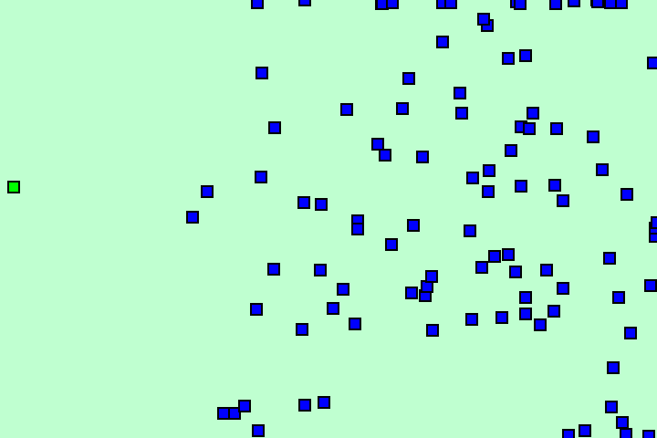
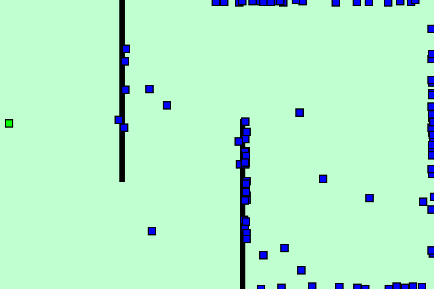
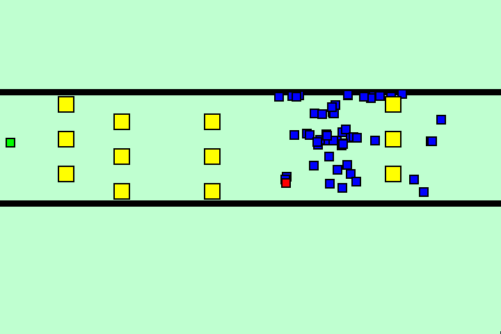

# Preface
One of my latest projects, this is an implementation of a genetic algorithm in the context of a pathfinding problem. 

# Algorithm
The algorithm used is a basic genetic one. Each player is given a *brain* containing a randomized set of instructions. As the program progresses through generations,
the best players reproduce and mutate, resulting in a gradual increase in the fitness of the entire population.

# Demonstration
## Explanation
To give some context to what is being shown on the screen:

🟦 Blue rectangles represent the players of the population
🟥 The red rectangle is the best player/champion of the previous *generation*. They are placed into the next generation without mutations so that progress doesn't get lost
🟩 The green rectangle is the goal which the players must reach
🟨 Yellow rectangles are enemies which also kill players on touch
⬛ Black rectangles are walls which kill players on touch

Each GIF represents one particular *level* of the simulation. GIFs start out during *generation one*, when players are mostly behaving randomly. The GIFs then
speed up as time passes and the population evolves and improves. When the GIF returns to regular speed, the solution found by the genetic algorithm (at that iteration)
can be seen.

Note that the algorithm has two stages: *search* and *optimization*. During the *search* phase, the AI will look for the goal on the map. Once the goal has been found,
the *optimization* stage begins, in which the AI attempts to gradually minimize the numbers of moves it needs to make in order to reach the goal. This is shown by the 
AI taking increasingly more direct paths to the goal compared to its initial solution.

## Example 1: No Obstacles
In this GIF a basic demonstration of the AI is shown, with no walls or enemies blocking the path. Fairly straightforward, and doesn't take long for the AI to find a path from 
its spawn point to the goal.

## Example 2: Wall Pathing
This demo showcases the AI learning to navigate around walls, which understandably takes longer than simply finding a straight path as in the previous GIF.

## Example 3: Enemy Avoidance
This final demo shows the AI learning to avoid enemy entities that are always on the move.

